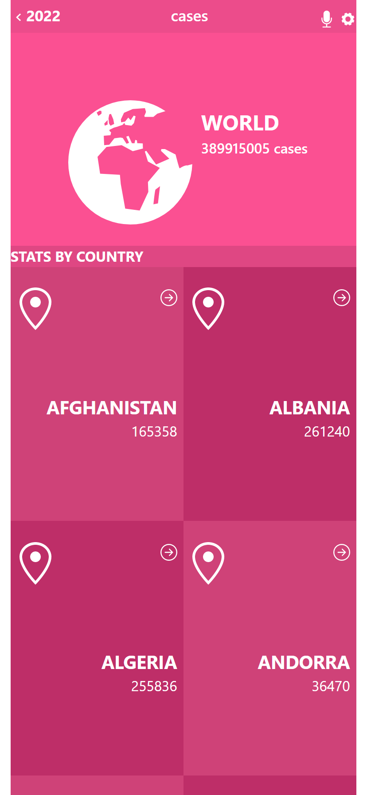

# Covid Metrics

> A hub for space travelers who want to reserve available rockets or join active missions.

Additional description about the project and its features.

## Built With

- React-Redux
- Bootstrap

## Tools
- Jest testing library
- Eslint & StyleLint
## Live Demo

[Live Demo Link](https://space-traveler-zaman-lucas.netlify.app/)

## Getting Started

To get a local copy up and running follow these simple example steps.

### Prerequisites
- Node.js

### Setup
- Clone this project and `cd` into the repository folder in the terminal.

### Install
- Enter `npm install` and then `npm run build` in the terminal.

### Usage
- Go to the 'Rockets' page to reserve rockets.
- Go to the 'Missions' page to join missions.
- Go to the profile page to see the chosen rockets and missions.

## Authors

👤 **Humaira Zaman**

- GitHub: [@qwibbler](https://github.com/qwibbler)
- Twitter: [@hmemaz](https://twitter.com/hmemaz)
- LinkedIn: [Humaira Zaman](https://www.linkedin.com/in/humaira-zaman/)

👤 **Khusiima Luke Masaba**

- GitHub: [@Lucas-Masaba](https://github.com/Lucas-Masaba)
- Twitter: [@MasabaLuke](https://twitter.com/MasabaLuke)
- LinkedIn: [Khusiima Luke Masaba](https://linkedin.com/in/khusiima-luke-masaba)

## 🤝 Contributing

Contributions, issues, and feature requests are welcome!

Feel free to check the [issues page](../../issues/).

## Show your support

Give a ⭐️ if you like this project!

## Acknowledgments

- <a href="https://www.flaticon.com/free-icons/planet" title="planet icons">Planet icons created by Freepik - Flaticon</a>

## 📝 License

This project is [MIT](./MIT.md) licensed.
